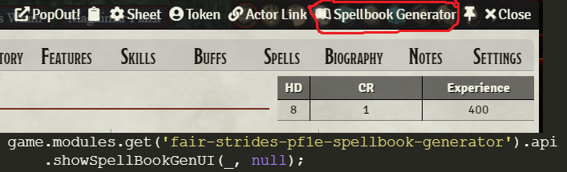
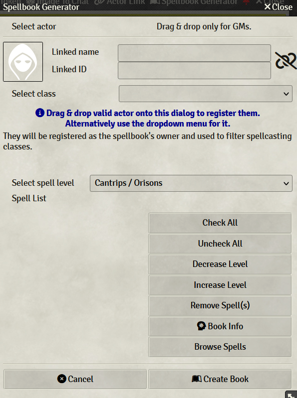
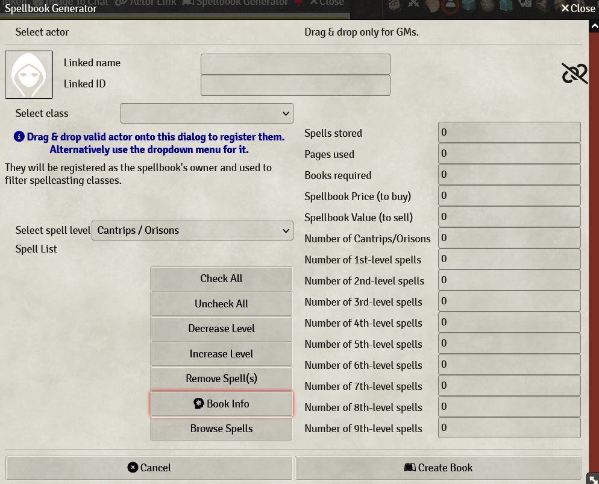

# Pathfinder 1E Spellbook Generator
A framework for creating and pricing spellbooks.

### New Features:

In version 2.1, I've added a way to save an in-progress spellbook to either the actor's flags or the world as a setting. You can also restore the data if desired, allowing for a way to "transfer" spellbook data between actors as it were. This does come with a warning, though: there is very little in the way of a saftey net here. If the world data doesn't exist, the spellbook will be reset to a blank slate of progress.

### Inspiration

I have a separate text file on my computer for years for calculating the cost of spells, and I've always found it tedious to price out spellbooks. I had the beginnings of an idea a while back when seeing what modules could do, and then I'd seen Noon's spellbook macro and thought I could use that for inspiration and spring board off of that idea. This would be that result, and I'm actually quite proud of how it's turned out as my first module.

Also, I'd like to take a moment to thank [M.A.](https://gitlab.com/mkahvi) (or Mana+2 on the Foundry discord) for allowing me to use and learn from Actor Link and being so friendly and helpful as I progressed; I'm sure I was getting annoying in the middle there. :D

### Usage

You can access the interface in two ways: 1) from an actor's title bar or 2) from a macro command

`game.modules.get('fair-strides-pf1e-spellbook-generator').api.showSpellBookGenUI(null, null);`

If you are a GM, you can drag-and-drop an actor onto the window to assign them as the book's owner. A player can do similar with a dropdown.

From here, you can open a spell compendium or use the Spells Browser to drag-and-drop spells into the window. If a class has been selected from the class list dropdown, then the spellbook generator tries to find the appropriate spell level for that casting class. If it can't find the class in the spell's casting list, it takes the average of all of the spell levels for the classes that can cast the spell (rounded down).

You can check your book's progress as you're building it by clicking the "Book Info" button to get a display of the book's progress off to the right of the window.

NOTE: It assumes a normal 100-page book in the stats display. This can be changed when you go to create the book.

When all is said and done and you're ready to build the spellbook or formula book, you can change which type of book it is (the Compact, Normal, or Travelling variety). These books have different weights, starting prices, and number of pages. The number of books needed to hold all of the spells will be updated accordingly when you change the book type. The price to buy and sell the book does NOT include the base cost of the book(s) themselves.

If there is no actor assigned, the book item will be made in the Items directory in the sidebar. On the other hand, if the actor is assigned, the book will be made in their inventory and have their name attached to it for a personal charm. Not only that, but the book will tell you what's in it...

### Configuration

None available as such, but if you have ideas, please make a feature request. :)

There is a toggleable setting that is used to flush the saved world data for an in-progress spellbook.

### Known Issues

1. I think the Macro might be GM-only (or might not like running in a browser); didn't like passing in a null actor when testing as a player in Firefox...

## Install

Manifest URL: https://raw.githubusercontent.com/Fair-Strides/Fvtt-PF1E-Spellbook-Generator/main/module.json

## Attribution

Similar to the great M.A., I'd appreciate a line in the credits if my work or myself were any help to you.

## License

This software is distributed under the [MIT License](./LICENSE), and by extension under [FVTT's Module Development License](https://foundryvtt.com/article/license/).

Dummy line to be removed.
